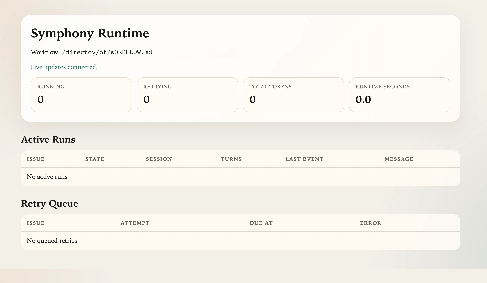

# Symphony ClickUp

Symphony is a local automation service that watches ClickUp for active tasks, gives each task its own workspace, and runs Codex inside that workspace until the task is finished or blocked.

It is designed for teams that want a repeatable "agent works the ticket" loop instead of manually launching one-off scripts.



## What Symphony Does

At a high level, Symphony:

1. Reads a local `WORKFLOW.md` file.
2. Polls ClickUp for tasks in the statuses you mark as active.
3. Creates a dedicated workspace folder for each task.
4. Runs Codex App Server inside that workspace.
5. Re-checks ClickUp after each turn and decides whether to continue, retry, or stop.
6. Optionally serves a small local dashboard and JSON API so you can see what it is doing.

Important: Symphony is the orchestrator. The actual task-handling behavior comes from the prompt and settings in `WORKFLOW.md`.

## How It Works

Symphony has two main inputs:

- `WORKFLOW.md`
  This file controls how Symphony behaves. The YAML front matter configures polling, workspaces, hooks, and Codex settings. The Markdown body becomes the prompt template sent to Codex for each task.
- `.env` / `.env.local`
  These files provide secrets and environment-specific values such as your ClickUp API token.

Typical flow:

1. Symphony starts and loads `.env`, `.env.local`, and `WORKFLOW.md`.
2. It asks ClickUp for tasks in the configured scope (`list_ids`, `space_ids`, and/or `folder_ids`) and active statuses.
3. For each eligible task, it creates or reuses a workspace folder.
4. Your workspace hooks prepare that folder. In most setups, `hooks.after_create` clones the target repository there.
5. Symphony launches `codex app-server` in that workspace and sends the rendered prompt.
6. If the task is still active after the turn, Symphony continues or retries. If the task moves to a terminal status, Symphony stops and can clean up the workspace.

## What This Repository Includes

- A TypeScript implementation of Symphony.
- A ClickUp tracker client.
- A local HTML dashboard and JSON API.
- Internal implementation docs: [`docs/README.md`](./docs/README.md)
- An example workflow file: [`WORKFLOW-EXAMPLE.md`](./WORKFLOW-EXAMPLE.md)
- A sample environment file: [`.env.example`](./.env.example)

## Requirements

Before you start, make sure you have:

- Node.js 20 or newer
- npm
- Git
- A ClickUp API token
- A Codex CLI installation that supports `app-server` in the same shell Symphony will use
- Access to the repository Symphony should clone into each task workspace

Optional but useful:

- GitHub CLI (`gh`) for PR-related steps inside your workflow prompt
- Playwright Chromium browsers (`npx playwright install chromium`) for opt-in review screenshots

## Quick Start

### 1. Install dependencies

```bash
npm install
```

If you plan to enable review screenshots, also install the Chromium browser used by Playwright:

```bash
npx playwright install chromium
```

### 2. Create your local environment file

Copy the example file and update the values:

```bash
cp .env.example .env.local
```

Minimum values:

```dotenv
CLICKUP_API_TOKEN=your-clickup-api-token
SYMPHONY_REPO_URL=https://github.com/your-org/your-repo.git
LOG_LEVEL=info
```

Notes:

- `CLICKUP_API_TOKEN` is required.
- `SYMPHONY_REPO_URL` is required only if your workflow hook uses it. The example workflow does.
- `LOG_LEVEL` is optional. Default: `info`.

### 3. Create or update `WORKFLOW.md`

The easiest starting point is:

```bash
cp WORKFLOW-EXAMPLE.md WORKFLOW.md
```

Then edit these values in `WORKFLOW.md`:

- `tracker.workspace_id`
- One or more of:
  - `tracker.list_ids`
  - `tracker.space_ids`
  - `tracker.folder_ids`
- `workspace.root`
- `hooks.after_create`
- `agent.max_turns`
- `codex.command` if your Codex launch command differs from the example
- `codex.model`
- `codex.reasoning_effort`
- `server.port` if you want the dashboard enabled

If you use the example workflow, replace the placeholder ClickUp IDs before starting.

### 4. Build the CLI

```bash
npm run build
```

### 5. Start Symphony

```bash
npm start
```

By default, Symphony looks for `WORKFLOW.md` in the current directory.

You can also pass a custom workflow path:

```bash
npm start -- ./path/to/WORKFLOW.md
```

You can override the dashboard port from the command line:

```bash
npm start -- --port 3000
```

### 6. Confirm it is running

If `server.port` is set in `WORKFLOW.md`, or you started Symphony with `--port`, open:

- [http://127.0.0.1:3000](http://127.0.0.1:3000)

You should see:

- the current workflow path
- how many tasks are running
- any queued retries
- Codex token totals

## The Two Files You Will Usually Edit

### `.env.local`

Use this for machine-specific values and secrets.

Symphony loads environment files from the same directory as the workflow file:

1. `.env`
2. `.env.local`
3. existing shell environment variables

Precedence is important:

- Shell environment variables win over everything else.
- `.env.local` overrides `.env`.

### `WORKFLOW.md`

This file has two parts:

1. YAML front matter
   Runtime settings for the service.
2. Markdown prompt body
   The instructions Symphony gives to Codex for each ClickUp task.

Think of it this way:

- Front matter = how Symphony runs
- Prompt body = how Codex should behave

The intended workflow is:

1. keep `WORKFLOW-EXAMPLE.md` as the versioned template
2. copy it to a local `WORKFLOW.md`
3. edit the local file for the machine or workspace you are running on

In this repository, `WORKFLOW.md` is treated as local runtime state and is ignored by Git.

## A Minimal Mental Model

Symphony does not automatically know how to prepare a repository workspace.

It only creates a directory for each task.

Your hook is what turns that empty folder into a usable project workspace. In the example workflow, this happens here:

```yaml
hooks:
  after_create: |
    : "${SYMPHONY_REPO_URL:?Set SYMPHONY_REPO_URL to the repository clone URL before starting Symphony.}"
    git clone --depth 1 "$SYMPHONY_REPO_URL" .
    if [ -f package-lock.json ]; then
      npm ci
    fi
```

That means:

- the first time a task gets a workspace, Symphony creates the folder
- the `after_create` hook clones the target repo into it
- future attempts reuse the same workspace folder unless it is removed

## Day-to-Day Behavior

These runtime rules are built into the app:

- Symphony only dispatches tasks in active statuses.
- Tasks in `Todo` with unfinished blockers are skipped until their blockers reach a terminal state.
- Each task gets a stable workspace folder based on its issue identifier.
- Successful runs are re-queued quickly if the task still remains active.
- Failed or stalled runs retry with exponential backoff.
- Runs that fail because Codex requested interactive input are marked blocked and held until the task changes in ClickUp.
- If a running task moves to a terminal status, Symphony cancels the run and cleans up that task workspace.
- On startup, Symphony also removes workspaces for tasks already in terminal statuses.
- Changes to `WORKFLOW.md` are reloaded automatically while Symphony is running.
- If you change the HTTP port, restart Symphony. The server does not re-bind to a new port automatically.

## Dashboard and API

When the HTTP server is enabled, Symphony binds to `127.0.0.1` only.

Available routes:

| Route | Method | What it does |
| --- | --- | --- |
| `/` | `GET` | Human-friendly HTML dashboard |
| `/api/v1/state` | `GET` | Full runtime snapshot as JSON |
| `/api/v1/events` | `GET` | Server-sent event stream of runtime snapshots for live dashboard updates |
| `/api/v1/:issue_identifier` | `GET` | Status for one Symphony issue identifier such as `CU-123` |
| `/api/v1/refresh` | `POST` | Queue an immediate poll/reconcile cycle |

The dashboard uses `EventSource` against `/api/v1/events`, so counts and tables update live without a manual refresh.

Examples:

```bash
curl http://127.0.0.1:3000/api/v1/state
```

```bash
curl -N http://127.0.0.1:3000/api/v1/events
```

```bash
curl http://127.0.0.1:3000/api/v1/CU-123
```

```bash
curl -X POST http://127.0.0.1:3000/api/v1/refresh
```

## Configuration Reference

All runtime config lives in the YAML front matter of `WORKFLOW.md`.

### `tracker`

| Key | Required | Default | Notes |
| --- | --- | --- | --- |
| `tracker.kind` | Yes | none | Must be `clickup` |
| `tracker.endpoint` | No | `https://api.clickup.com/api/v2` | Base ClickUp API URL |
| `tracker.api_key` | Yes | `$CLICKUP_API_TOKEN` | Can be a literal string or env reference |
| `tracker.workspace_id` | Yes | none | ClickUp Workspace/team ID |
| `tracker.space_ids` | No | empty | Optional ClickUp Space filters |
| `tracker.folder_ids` | No | empty | Optional ClickUp Folder filters |
| `tracker.list_ids` | No | empty | Optional ClickUp List filters |
| `tracker.active_states` | No | `Todo`, `In Progress` | Statuses Symphony should work on |
| `tracker.terminal_states` | No | `Closed`, `Cancelled`, `Canceled`, `Duplicate`, `Done` | Statuses that stop work and trigger cleanup |

Important:

- You must provide at least one scope filter: `space_ids`, `folder_ids`, or `list_ids`.
- State matching is case-insensitive.

### `polling`

| Key | Required | Default | Notes |
| --- | --- | --- | --- |
| `polling.interval_ms` | No | `30000` | How often Symphony polls ClickUp |

### `workspace`

| Key | Required | Default | Notes |
| --- | --- | --- | --- |
| `workspace.root` | No | system temp directory + `symphony_workspaces` | Parent folder for per-task workspaces |

Path behavior:

- `~` expands to your home directory
- `$VAR` reads from the environment
- relative paths are resolved from the current working directory

### `hooks`

| Key | Required | Default | Notes |
| --- | --- | --- | --- |
| `hooks.after_create` | No | none | Runs once when a new workspace is created |
| `hooks.before_run` | No | none | Runs before every attempt |
| `hooks.after_run` | No | none | Runs after every attempt |
| `hooks.before_remove` | No | none | Runs before a workspace is deleted |
| `hooks.timeout_ms` | No | `60000` | Timeout for all hooks |

Hook behavior:

- `after_create` failure is fatal and the new workspace is removed
- `before_run` failure is fatal for that attempt
- `after_run` failure is logged but does not fail the run
- `before_remove` failure is logged but cleanup continues

Hooks run in your login shell (`$SHELL`, falling back to `bash`).

### `agent`

| Key | Required | Default | Notes |
| --- | --- | --- | --- |
| `agent.max_concurrent_agents` | No | `10` | Global task concurrency |
| `agent.max_concurrent_agents_by_state` | No | `{}` | Optional per-status concurrency overrides |
| `agent.max_retry_backoff_ms` | No | `300000` | Maximum retry backoff |
| `agent.max_turns` | No | `20` | Maximum Codex turns per dispatch |

Retry behavior:

- first retry waits about 10 seconds
- later retries back off exponentially until `max_retry_backoff_ms`

### `codex`

| Key | Required | Default | Notes |
| --- | --- | --- | --- |
| `codex.command` | No | `codex app-server` | Command Symphony launches for each workspace |
| `codex.model` | No | unset | Optional app-server model override passed on `thread/start` and `turn/start` |
| `codex.reasoning_effort` | No | unset | Optional turn effort override passed as `effort` on `turn/start` |
| `codex.personality` | No | unset | Optional Codex personality override |
| `codex.service_name` | No | unset | Optional service label passed on `thread/start` |
| `codex.approval_policy` | No | `never` | Passed through to Codex |
| `codex.thread_sandbox` | No | `workspace-write` | Passed through to Codex when the thread starts |
| `codex.turn_sandbox_policy` | No | `{ type: "workspace-write" }` | Passed through for each turn |
| `codex.turn_timeout_ms` | No | `3600000` | Maximum time for a single turn |
| `codex.read_timeout_ms` | No | `5000` | RPC request/response timeout |
| `codex.stall_timeout_ms` | No | `300000` | Cancels a run if no Codex event is seen within this window |

The example workflow keeps the shell command focused on launching app-server, and puts model-level overrides in explicit workflow keys:

```yaml
codex:
  command: codex --config shell_environment_policy.inherit=all app-server
  model: gpt-5.3-codex
  reasoning_effort: xhigh
  personality: pragmatic
  service_name: symphony
```

Use whatever Codex launch command matches your environment. Prefer keeping model and effort settings in the explicit workflow keys unless you have a shell-specific reason to inline them into `codex.command`.

### `screenshots`

Review screenshots are opt-in. When enabled, Symphony advertises a first-party Codex tool that captures a local browser page with Playwright, uploads the PNG to the ClickUp task as an attachment, and adds a `## Codex Screenshot` comment.

| Key | Required | Default | Notes |
| --- | --- | --- | --- |
| `screenshots.enabled` | No | `false` | Enables the screenshot dynamic tool |
| `screenshots.output_dir` | No | `.symphony-artifacts/screenshots` | Relative paths resolve under `workspace.root`, not inside a task repo |
| `screenshots.max_files_per_attempt` | No | `8` | Maximum screenshots one Codex attempt may attach |
| `screenshots.max_file_bytes` | No | `10485760` | Maximum PNG size before upload |

Example:

```yaml
screenshots:
  enabled: true
  output_dir: .symphony-artifacts/screenshots
  max_files_per_attempt: 8
  max_file_bytes: 10485760
```

The screenshot tool only accepts local review URLs: `localhost`, `127.0.0.1`, `[::1]`, or `file://` paths inside the active workspace. Codex is still responsible for starting the target app with the target repository's existing scripts when a visual screenshot is applicable.

### `server`

| Key | Required | Default | Notes |
| --- | --- | --- | --- |
| `server.port` | No | disabled | Starts the local dashboard/API on this port |

You can also set the port at runtime with `--port`. The CLI value overrides `server.port`.

## Prompt Template Variables

The body of `WORKFLOW.md` is rendered with Liquid templates.

Available values include:

| Variable | Meaning |
| --- | --- |
| `issue.id` | Raw ClickUp task ID |
| `issue.clickup_task_id` | Same as `issue.id` |
| `issue.identifier` | Symphony issue identifier, such as `CU-123` |
| `issue.title` | Task title |
| `issue.description` | Task description |
| `issue.priority` | Normalized priority if available |
| `issue.state` | Current ClickUp status |
| `issue.url` | Task URL |
| `issue.labels` | Lowercased ClickUp tags |
| `issue.blocked_by` | Blocker list with `id`, `identifier`, and `state` |
| `issue.created_at` | Creation time |
| `issue.updated_at` | Update time |
| `attempt` | `null` on first dispatch, then a retry/continuation number |

Example:

```md
You are working on ClickUp task {{ issue.identifier }}.

Title: {{ issue.title }}
Status: {{ issue.state }}


This is retry attempt #{{ attempt }}.

```

If the prompt body is empty, Symphony falls back to:

```text
You are working on an issue from ClickUp.
```

## Built-In ClickUp Tools for Codex

Symphony can advertise first-party ClickUp tools to Codex during a run.

These tools are:

- `clickup_get_task`
- `clickup_update_task`
- `clickup_get_task_comments`
- `clickup_create_task_comment`
- `clickup_capture_review_screenshot` when `screenshots.enabled` is true

This is useful because your workflow prompt can instruct Codex to:

- read the latest task details
- add worklog comments
- update task status
- update the task description
- attach browser screenshots for local visual review

## Scripts

| Command | What it does |
| --- | --- |
| `npm run build` | Compile TypeScript to `dist/` |
| `npm start` | Run the compiled CLI |
| `npm run typecheck` | Run TypeScript checks without building |
| `npm test` | Run the Vitest test suite |

The real Chromium screenshot smoke test is gated because it requires installed Playwright browsers:

```bash
RUN_PLAYWRIGHT_SCREENSHOT_TEST=1 npm test -- tests/screenshot-capturer.test.ts
```

## Recommended First Run

If you are setting this up for the first time, this order works well:

1. `npm install`
2. `cp .env.example .env.local`
3. `cp WORKFLOW-EXAMPLE.md WORKFLOW.md`
4. Fill in your ClickUp IDs and token
5. Build with `npm run build`
6. Start with `npm start -- --port 3000`
7. Open the dashboard and confirm Symphony sees the expected tasks

## Troubleshooting

### Symphony starts but does not pick up any tasks

Check:

- the ClickUp token is valid
- `tracker.workspace_id` is correct
- at least one of `list_ids`, `space_ids`, or `folder_ids` is set
- the task status exactly matches one of your `active_states`
- the task is not blocked by a non-terminal dependency if it is in `Todo`

### The workspace folder is empty

Symphony only creates the directory. Your hook must populate it. If you expect a cloned repo, check `hooks.after_create`.

### The dashboard does not open

Check:

- `server.port` is set in `WORKFLOW.md`, or you started Symphony with `--port`
- the port is not already in use
- you are opening `127.0.0.1`, not a remote host

### Tasks keep retrying

That usually means one of these:

- Codex failed to complete a turn
- a hook failed
- ClickUp polling failed
- the run stalled and exceeded `codex.stall_timeout_ms`

Set `LOG_LEVEL=debug` for more detail.

### Codex exits immediately with a missing optional dependency

If the retry error mentions a missing package such as `@openai/codex-darwin-x64` or `@openai/codex-darwin-arm64`, reinstall Codex in the same Node environment Symphony uses:

```bash
nvm use <your-node-version>
npm uninstall -g @openai/codex
npm install -g @openai/codex@latest --include=optional
hash -r
codex --version
```

If you do not use `nvm`, activate whatever Node installation provides `codex` first. If `codex --version` still fails, check whether npm is omitting optional dependencies with `npm config get omit`.

### A task stopped retrying after asking for input

If Codex requests interactive input during an unattended run, Symphony now treats the issue as blocked instead of retrying the same attempt immediately.

Symphony will try the task again only after the ClickUp task changes, such as a status update, description edit, or comment that updates the task timestamp.

### Codex can work locally but cannot handle GitHub PR steps

Symphony checks for GitHub CLI availability and authentication. If `gh` is missing or not authenticated, PR-related workflow steps may stop early.

### I changed `WORKFLOW.md` but the dashboard port did not change

Workflow content is reloaded automatically, but the HTTP server does not move to a new port until Symphony is restarted.

## Development Notes

- Source files live in [`src/`](./src).
- Tests live in [`tests/`](./tests).
- The CLI entry point is [`src/cli.ts`](./src/cli.ts).
- The service bootstrapping logic is in [`src/service.ts`](./src/service.ts).
- The orchestrator lives in [`src/orchestrator.ts`](./src/orchestrator.ts).

## License

This project is licensed under the Apache License 2.0. See [LICENSE](./LICENSE).
