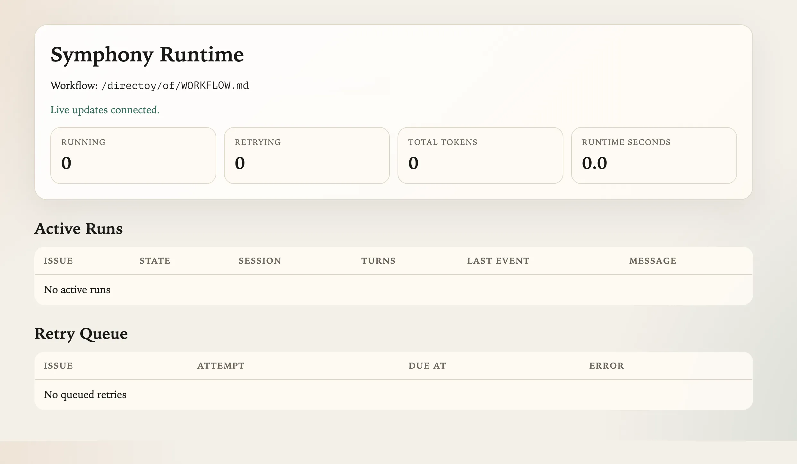

# Symphony ClickUp

Symphony is a local automation service that watches ClickUp for active tasks, gives each task its own workspace, and runs Codex inside that workspace until the task is finished or blocked.

It is designed for teams that want a repeatable "agent works the ticket" loop instead of manually launching one-off scripts.



## What Symphony Does

At a high level, Symphony:

1. Reads a local `WORKFLOW.md` file.
2. Polls ClickUp for tasks in the statuses you mark as active.
3. Creates a dedicated workspace folder for each task.
4. Runs Codex App Server inside that workspace.
5. Re-checks ClickUp after each turn and decides whether to continue, retry, or stop.
6. Optionally serves a small local dashboard and JSON API so you can see what it is doing.

Important: Symphony is the orchestrator. The actual task-handling behavior comes from the prompt and settings in `WORKFLOW.md`.

## How It Works

Symphony has two main inputs:

- `WORKFLOW.md`
  This file controls how Symphony behaves. The YAML front matter configures polling, workspaces, hooks, and Codex settings. The Markdown body becomes the prompt template sent to Codex for each task.
- `.env` / `.env.local`
  These files provide secrets and environment-specific values such as your ClickUp API token.

Typical flow:

1. Symphony starts and loads `.env`, `.env.local`, and `WORKFLOW.md`.
2. It asks ClickUp for tasks in the configured scope (`list_ids`, `space_ids`, and/or `folder_ids`) and active statuses.
3. For each eligible task, it creates or reuses a workspace folder.
4. Your workspace hooks prepare that folder. In most setups, `hooks.after_create` clones the target repository there.
5. Symphony launches `codex app-server` in that workspace and sends the rendered prompt.
6. If the task is still active after the turn, Symphony continues or retries. If the task moves to a terminal status, Symphony stops and can clean up the workspace.

## What This Repository Includes

- A TypeScript implementation of Symphony.
- A ClickUp tracker client.
- A local HTML dashboard and JSON API.
- Internal implementation docs: [`docs/README.md`](./docs/README.md)
- User guide docs: [`docs/user-guide/`](./docs/user-guide/)
- An example workflow file: [`WORKFLOW-EXAMPLE.md`](./WORKFLOW-EXAMPLE.md)
- A sample environment file: [`.env.example`](./.env.example)
- Contributor docs: [`CONTRIBUTING.md`](./CONTRIBUTING.md)
- Security policy: [`SECURITY.md`](./SECURITY.md)
- Release history: [`CHANGELOG.md`](./CHANGELOG.md)

## Requirements

Before you start, make sure you have:

| Requirement | Needed for | Notes |
| --- | --- | --- |
| Node.js 20 or newer | all local development and runtime use | `package.json` declares `>=20` |
| npm | dependency installation and scripts | use the checked-in `package-lock.json` |
| Git | repository checkout and typical workspace hooks | the example workflow clones a target repository |
| ClickUp API token | real ClickUp polling and task updates | set as `CLICKUP_API_TOKEN` |
| Codex CLI with `app-server` support | running agents | must work in the same shell Symphony uses |
| Target repository access | task workspaces | needed by the repository clone hook in the example workflow |

Optional but useful:

- GitHub CLI (`gh`) for PR-related steps inside your workflow prompt; the active account must be able to access the workspace repository
- Playwright Chromium browsers (`npx playwright install chromium`) for opt-in review screenshots

See the [Compatibility Guide](./docs/user-guide/compatibility.md) for version and integration details.

## Quick Start

### 1. Install dependencies

```bash
npm install
```

If you plan to enable review screenshots, also install the Chromium browser used by Playwright:

```bash
npx playwright install chromium
```

### 2. Create your local environment file

Copy the example file and update the values:

```bash
cp .env.example .env.local
```

Minimum values:

```dotenv
CLICKUP_API_TOKEN=your-clickup-api-token
SYMPHONY_REPO_URL=https://github.com/your-org/your-repo.git
LOG_LEVEL=info
```

Notes:

- `CLICKUP_API_TOKEN` is required.
- `SYMPHONY_REPO_URL` is required only if your workflow hook uses it. The example workflow does.
- `LOG_LEVEL` is optional. Default: `info`.

### 3. Create or update `WORKFLOW.md`

The easiest starting point is:

```bash
cp WORKFLOW-EXAMPLE.md WORKFLOW.md
```

Then edit these values in `WORKFLOW.md`:

- `tracker.workspace_id`
- One or more of:
  - `tracker.list_ids`
  - `tracker.space_ids`
  - `tracker.folder_ids`
- `workspace.root`
- `hooks.after_create`
- `agent.max_turns`
- `codex.command` if your Codex launch command differs from the example
- `codex.model`
- `codex.reasoning_effort`
- `audit.output_dir` and retention settings if you want audit logs somewhere other than the workspace artifacts folder
- `server.port` if you want the dashboard enabled

If you use the example workflow, replace the placeholder ClickUp IDs before starting.

### 4. Build the CLI

```bash
npm run build
```

### 5. Start Symphony

```bash
npm start
```

By default, Symphony looks for `WORKFLOW.md` in the current directory.

You can also pass a custom workflow path:

```bash
npm start -- ./path/to/WORKFLOW.md
```

You can override the dashboard port from the command line:

```bash
npm start -- --port 3000
```

### 6. Confirm it is running

If `server.port` is set in `WORKFLOW.md`, or you started Symphony with `--port`, open:

- [http://127.0.0.1:3000](http://127.0.0.1:3000)

You should see:

- the current workflow path
- how many tasks are running
- any queued retries
- Codex token totals

## The Two Files You Will Usually Edit

### `.env.local`

Use this for machine-specific values and secrets.

Symphony loads environment files from the same directory as the workflow file:

1. `.env`
2. `.env.local`
3. existing shell environment variables

Precedence is important:

- Shell environment variables win over everything else.
- `.env.local` overrides `.env`.

### `WORKFLOW.md`

This file has two parts:

1. YAML front matter
   Runtime settings for the service.
2. Markdown prompt body
   The instructions Symphony gives to Codex for each ClickUp task.

Think of it this way:

- Front matter = how Symphony runs
- Prompt body = how Codex should behave

The intended workflow is:

1. keep `WORKFLOW-EXAMPLE.md` as the versioned template
2. copy it to a local `WORKFLOW.md`
3. edit the local file for the machine or workspace you are running on

In this repository, `WORKFLOW.md` is treated as local runtime state and is ignored by Git.
The checked-in `WORKFLOW-EXAMPLE.md` keeps the prompt intentionally compact because that body is sent to every agent first turn.

## A Minimal Mental Model

Symphony does not automatically know how to prepare a repository workspace.

It only creates a directory for each task.

Your hook is what turns that empty folder into a usable project workspace. In the example workflow, this happens here:

```yaml
hooks:
  after_create: |
    : "${SYMPHONY_REPO_URL:?Set SYMPHONY_REPO_URL to the repository clone URL before starting Symphony.}"
    git clone --depth 1 "$SYMPHONY_REPO_URL" .
    if [ -f package-lock.json ]; then
      npm ci
    fi
```

That means:

- the first time a task gets a workspace, Symphony creates the folder
- the `after_create` hook clones the target repo into it
- future attempts reuse the same workspace folder unless it is removed

## Day-to-Day Behavior

These runtime rules are built into the app:

- Symphony only dispatches tasks in active statuses.
- Tasks in `Todo` with unfinished blockers are skipped until their blockers reach a terminal state.
- Each task gets a stable workspace folder based on its issue identifier.
- Successful runs are re-queued quickly if the task still remains active.
- Failed or stalled runs retry with exponential backoff.
- Runs that fail because Codex requested interactive input are marked blocked and held until the task changes in ClickUp.
- If a running task moves to a terminal status, Symphony cancels the run and cleans up that task workspace.
- On startup, Symphony also removes workspaces for tasks already in terminal statuses.
- Changes to `WORKFLOW.md` are reloaded automatically while Symphony is running.
- If you change the HTTP port, restart Symphony. The server does not re-bind to a new port automatically.
- Agent lifecycle, Codex, tool, workspace, and scheduler activity is written to persistent audit JSONL files when `audit.enabled` is true.

## User Guide

The root README is the quick-start path. Detailed operator docs live under `docs/user-guide/`:

| Guide | What it covers |
| --- | --- |
| [Compatibility](./docs/user-guide/compatibility.md) | Node, npm, ClickUp, Codex, Git, and Playwright assumptions |
| [Configuration](./docs/user-guide/configuration.md) | `WORKFLOW.md`, environment files, prompt variables, and built-in ClickUp tools |
| [Operations](./docs/user-guide/operations.md) | runtime behavior, dashboard routes, API examples, scripts, and first-run checklist |
| [Troubleshooting](./docs/user-guide/troubleshooting.md) | common setup, runtime, Codex, and dependency problems |

For implementation-oriented docs, start with [`docs/README.md`](./docs/README.md).

## Scripts

| Command | What it does |
| --- | --- |
| `npm run build` | Compile TypeScript to `dist/` |
| `npm start` | Run the compiled CLI |
| `npm run typecheck` | Run TypeScript checks without building |
| `npm test` | Run the Vitest test suite |

The real Chromium screenshot smoke test is gated because it requires installed Playwright browsers:

```bash
RUN_PLAYWRIGHT_SCREENSHOT_TEST=1 npm test -- tests/screenshot-capturer.test.ts
```

## Development Notes

- Source files live in [`src/`](./src).
- Tests live in [`tests/`](./tests).
- The CLI entry point is [`src/cli.ts`](./src/cli.ts).
- The service bootstrapping logic is in [`src/service.ts`](./src/service.ts).
- The orchestrator lives in [`src/orchestrator.ts`](./src/orchestrator.ts).
- Contributor setup and pull request guidance live in [`CONTRIBUTING.md`](./CONTRIBUTING.md).
- Security reporting and runtime safety notes live in [`SECURITY.md`](./SECURITY.md).

## License

This project is licensed under the Apache License 2.0. See [LICENSE](./LICENSE).
